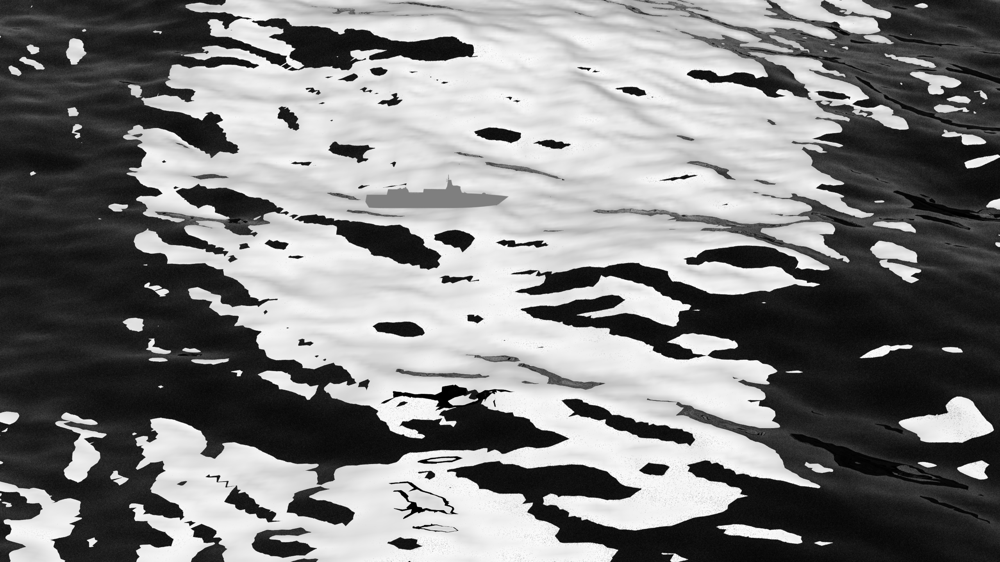
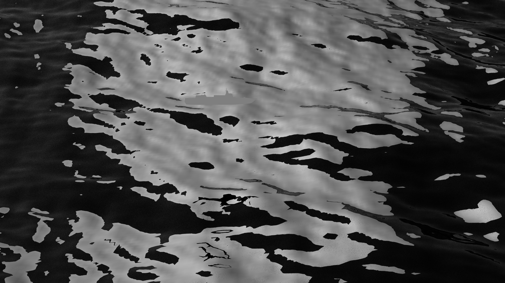
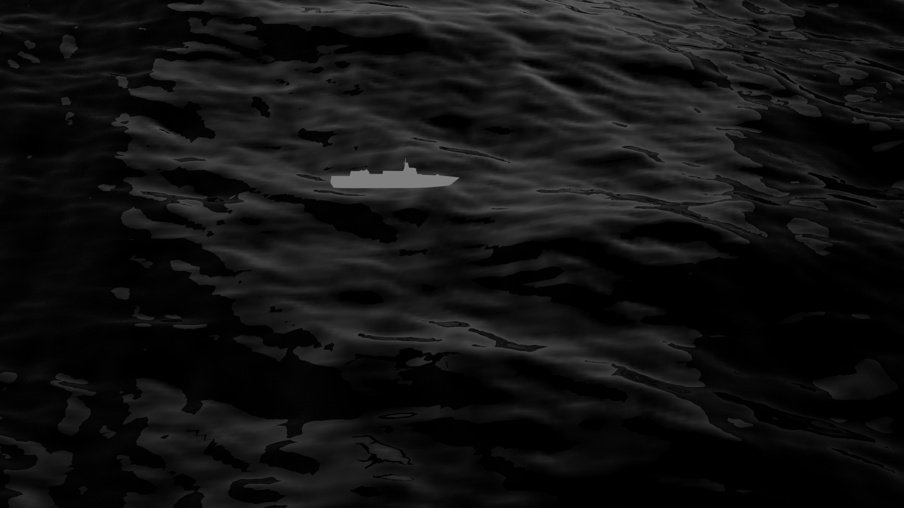
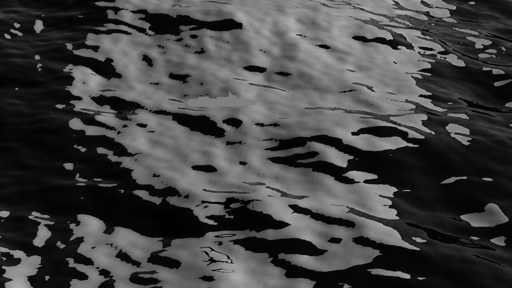

# 基于Mitsuba的海面偏振渲染与可视化

> 使用物理渲染引擎Mitsuba实现海面在太阳光照射下的偏振效应仿真，并通过Stokes参数分析和可视化偏振强度分布。

## 📋 目录

- [概述](#概述)
- [理论基础](#理论基础)
- [实现原理](#实现原理)
- [项目组成架构](#项目组成架构)
- [核心代码解析](#核心代码解析)
- [使用方法](#使用方法)
- [结果展示](#结果展示)
- [技术细节](#技术细节)
- [总结与展望](#总结与展望)
- [参考文献](#参考文献)

---

## 概述

本博客介绍如何使用**Mitsuba 3**物理渲染引擎实现海面偏振渲染，并通过**Stokes参数**分析不同偏振角度的强度分布。

### 问题背景

在海面目标探测与识别中，**太阳光引起的海面耀斑（Sun Glint）**是一个严重的干扰因素。当太阳光以特定角度照射海面时，镜面反射会产生强烈的耀斑，导致：

- 🌊 **背景干扰严重**: 海面耀斑的亮度远高于目标物体，使目标被"淹没"在强光中
- 👁️ **视觉对比度降低**: 传统成像方法难以区分目标与背景，目标识别困难
- 📡 **探测能力受限**: 强耀斑干扰降低了光学探测系统的有效探测距离和识别精度

### 偏振成像解决方案

**偏振成像技术**为解决这一问题提供了有效途径。由于**目标与背景的偏振特征不同**，通过偏振成像可以：

- ✅ **去除耀斑干扰**: 海面镜面反射产生的耀斑具有特定的偏振特性，可以通过偏振滤波有效抑制
- ✅ **增强目标对比度**: 目标物体（如船舶）的反射特性与海面不同，在偏振图像中表现出更高的对比度
- ✅ **提高探测能力**: 偏振成像能够有效捕捉目标，即使在强耀斑干扰条件下也能实现目标识别

该技术可用于海洋光学研究、偏振成像系统仿真、海面目标探测等应用场景。`**由于目标与背景的偏振特征不同，通过偏振成像，可增加目标与背景的对比度，有效捕捉目标**`。

### 主要特性

- ✅ 基于物理的偏振渲染（Physically Based Polarized Rendering）
- ✅ RGB三通道Stokes参数提取
- ✅ 多角度偏振强度计算（0°, 45°, 90°, 135°）
- ✅ 16位/32位高精度灰度图输出
- ✅ 批量场景处理支持

### 技术栈

- **渲染引擎**: Mitsuba 3 (`cuda_ad_spectral_polarized` variant)
- **编程语言**: Python 3
- **核心库**: NumPy, PIL/Pillow, Matplotlib, tifffile
- **图像格式**: EXR, PNG, TIFF (16-bit, 32-bit)

---

## 理论基础

### 光的偏振

光是一种横波，其电场矢量的振动方向称为**偏振方向**。当光在海面反射时，不同角度的反射光会产生不同的偏振特性，这一现象称为**偏振反射**。具体偏振原理可参考https://mitsuba.readthedocs.io/en/latest/src/key_topics/polarization.html

### Stokes参数

Stokes参数是描述光偏振状态的四个实数参数：

$$
\mathbf{S} = \begin{bmatrix} S_0 \\ S_1 \\ S_2 \\ S_3 \end{bmatrix}
$$

- **S₀**: 总光强度（Total Intensity）
- **S₁**: 水平与垂直偏振的差（Horizontal vs Vertical Polarization）
- **S₂**: 45°与135°偏振的差（Diagonal Polarization）
- **S₃**: 左右圆偏振的差（Circular Polarization）

### 偏振角度强度

给定Stokes参数，我们可以计算不同偏振角度（θ）的强度：

$$
I(\theta) = \frac{1}{2}(S_0 + S_1 \cos 2\theta + S_2 \sin 2\theta)
$$

对于常用角度：
- **0°**: $I_0 = \frac{S_0 + S_1}{2}$
- **45°**: $I_{45} = \frac{S_0 + S_2}{2}$
- **90°**: $I_{90} = \frac{S_0 - S_1}{2}$
- **135°**: $I_{135} = \frac{S_0 - S_2}{2}$

### 偏振度（DOP）

偏振度定义为偏振部分的强度与总强度的比值：

$$
\text{DOP} = \frac{\sqrt{S_1^2 + S_2^2 + S_3^2}}{S_0}
$$

---

## 实现原理

### 渲染流程

1. **场景渲染**: 使用Mitsuba的偏振渲染变体加载场景并渲染
2. **Stokes提取**: 从渲染结果中提取RGB三通道的Stokes参数
3. **角度计算**: 基于Stokes参数计算各偏振角度强度
4. **后处理**: 转换为灰度图并保存为不同位深的TIFF格式

### RGB通道处理

对于RGB三通道，我们对每个通道分别计算Stokes参数和偏振角度强度：

```python
# S0, S1, S2, S3 都是 (H, W, 3) 形状的数组
# 对每个RGB通道分别计算偏振角度强度
i0_rgb = (s0_rgb + s1_rgb) / 2      # 0°强度 (H, W, 3)
i45_rgb = (s0_rgb + s2_rgb) / 2     # 45°强度 (H, W, 3)
i90_rgb = (s0_rgb - s1_rgb) / 2     # 90°强度 (H, W, 3)
i135_rgb = (s0_rgb - s2_rgb) / 2    # 135°强度 (H, W, 3)
```

---

## 项目组成架构

本项目主要由以下部分组成：

### 目录结构

```
sea/
├── sea_pol.py                    # 场景渲染脚本（主程序）
├── scenes-visible/               # 场景定义XML文件目录
│   ├── sea_background1/          # 背景场景1
│   │   ├── Level_5.xml           # 场景配置文件 （海面约5%的太阳耀斑）
│   │   ├── Level_20.xml          # 场景配置文件 （海面约20%的太阳耀斑）
│   │   ├── Level_35.xml          # 场景配置文件 （海面约35%的太阳耀斑）
│   │   ├── Level_55.xml          # 场景配置文件 （海面约55%的太阳耀斑）
│   │   └── meshes/               # 网格模型目录
│   │       ├── ocean_phillips.obj    # 海面波浪网格（Phillips频谱模型）
│   │       ├── sky_dome.obj          # 天空穹顶网格
│   │       └── 55.obj                # 目标物体网格
│   ├── sea_background2/          # 背景场景2
│   ├── sea_background3/          # 背景场景3
│   └── sea_background4/          # 背景场景4
├── result_pic/                   # 渲染结果图

```

### 核心组件说明

#### 1. `sea/sea_pol.py` - 场景渲染脚本

这是项目的核心渲染脚本，负责：

- **场景加载与渲染**: 使用Mitsuba加载XML场景文件并进行偏振渲染
- **Stokes参数提取**: 从渲染结果中提取RGB三通道的Stokes参数（S0, S1, S2, S3）
- **偏振角度计算**: 计算0°, 45°, 90°, 135°四个偏振角度的强度分布
- **图像后处理**: 将RGB图像转换为16位/32位灰度图并保存为TIFF格式
- **批量处理**: 支持批量处理多个背景场景和太阳高度角的组合

**主要函数**:
- `render_ocean_scene()` - 渲染海面偏振场景
- `analyze_ocean_polarization()` - 分析偏振结果
- `analyze_rgb_polarization()` - RGB偏振分析
- `calculate_rgb_polarization_angles()` - 计算偏振角度强度
- `convert_rgb_to_grayscale()` - RGB转灰度图
- `convert_16bit_to_32bit()` - 16位转32位
- `main()` - 批量处理主函数

#### 2. `sea/scenes-visible/` - 场景定义目录

该目录包含所有场景的XML配置文件，每个场景文件定义了：

- **渲染参数**: 分辨率、采样数、积分器类型
- **相机设置**: 视角、位置、焦距
- **材质属性**: 水面BSDF、目标物体材质
- **光源配置**: 太阳光、天空光、环境光
- **网格模型引用**: 指向OBJ格式的3D网格文件

**场景组织方式**:
- `sea_background1/2/3/4`: 四种不同的背景场景配置
- `Level_5/20/35/55.xml`:  海面太阳耀斑干扰等级
- 每个场景目录下的`meshes/`文件夹包含该场景使用的所有OBJ网格模型

#### 3. 网格模型（OBJ文件）

场景中使用的3D网格模型存储在各自的`meshes/`目录中：

- **`ocean_phillips.obj`**: 海面波浪网格，基于Phillips频谱模型生成的海面几何形状，定义了海面的起伏和波浪结构
- **`sky_dome.obj`**: 天空穹顶网格，用于模拟天空背景和环境光照
- **`55.obj`**: 目标物体网格，用于模拟海面上的目标（如船舶等），用于研究目标与背景的偏振对比度

这些OBJ文件定义了场景的几何形状，是物理渲染的基础。

---

### 场景配置文件详解：`Level_5.xml`

以`sea/scenes-visible/sea_background1/Level_5.xml`为例，详细介绍场景配置的各个组成部分：

#### 1. 渲染参数设置

```xml
<default name="spp" value="256"/>      <!-- 每像素采样数：256次采样 -->
<default name="width" value="2560"/>  <!-- 图像宽度：2560像素 -->
<default name="height" value="1440"/>  <!-- 图像高度：1440像素 -->
```

- **spp (Samples Per Pixel)**: 控制渲染质量，值越高渲染越精细但耗时越长
- **分辨率**: 2560×1440，适合高质量输出

#### 2. 偏振积分器配置

```xml
<integrator type="stokes">
    <integrator type='path'>
        <integer name="max_depth" value="8"/>  <!-- 最大光线追踪深度：8次反射 -->
    </integrator>
</integrator>
```

- **`stokes`积分器**: 这是Mitsuba的偏振渲染积分器，会自动计算并输出Stokes参数
- **`path`积分器**: 作为内层积分器，使用路径追踪算法进行光线追踪
- **`max_depth`**: 限制光线反射/折射的最大次数，防止无限递归

#### 3. 相机设置

```xml
<sensor type="perspective" id="sensor">
    <float name="fov" value="35"/>  <!-- 视野角度：35度 -->
    <transform name="to_world">
        <lookat origin="0, 90, 40"    <!-- 相机位置：(0, 90, 40) -->
                target="0, 0, -6"      <!-- 观察目标点：(0, 0, -6) -->
                up="0, 0, 1"/>         <!-- 上方向向量：Z轴正方向 -->
    </transform>
    <sampler type="independent">
        <integer name="sample_count" value="$spp"/>  <!-- 使用全局spp参数 -->
    </sampler>
    <film type="hdrfilm">
        <integer name="width"  value="$width"/>
        <integer name="height" value="$height"/>
        <rfilter type="gaussian"/>  <!-- 高斯滤波抗锯齿 -->
    </film>
</sensor>
```

- **相机类型**: 透视相机（perspective），模拟真实相机视角
- **观察角度**: 从斜上方（高度90，距离40）观察海面（目标点z=-6）
- **HDR输出**: 使用高动态范围（HDR）格式，支持浮点精度

#### 4. 材质定义（BSDF）

```xml
<!-- 水面材质 -->
<bsdf type="dielectric" id="water3_5">
    <float name="int_ior" value="1.31"/>  <!-- 内部折射率：1.31（水的折射率） -->
    <float name="ext_ior" value="1"/>      <!-- 外部折射率：1（空气） -->
    <rgb name="specular_reflectance" value="0.05, 0.22, 0.45"/>  <!-- 镜面反射率（RGB） -->
</bsdf>
```

- **`dielectric`材质**: 模拟透明介电质（如水），支持折射和反射
- **折射率**: 定义光线从空气（n=1）进入水（n=1.31）时的折射行为
- **镜面反射率**: RGB三通道的反射系数，影响不同波长的反射强度

#### 5. 光源配置

```xml
<!-- 球面光源（模拟太阳） -->
<shape type="sphere" id="sky_light">
    <point name="center" value="0, -216.36, 70"/>  <!-- 光源中心位置 -->
    <float name="radius" value="18.0"/>             <!-- 光源半径：18单位 -->
    <ref id="white"/>
    <emitter type="area">
        <rgb name="radiance" value="300, 100, 100"/>  <!-- 辐射强度（RGB）：模拟蓝色天空光 -->
    </emitter>
</shape>

<!-- 天空穹顶光源 -->
<shape type="obj">
    <string name="filename" value="meshes/sky_dome.obj"/>  <!-- 天空网格模型 -->
    <transform name="to_world">
        <scale value="5"/>  <!-- 缩放5倍 -->
    </transform>
    <ref id="white"/>
    <emitter type="area">
        <spectrum name="radiance" value="5"/>  <!-- 热辐射强度：5（中波红外特性） -->
    </emitter>
</shape>
```

- **球面光源**: 使用球体作为面积光源，模拟太阳光照射
- **天空穹顶**: 使用OBJ网格定义天空形状，并作为环境光源
- **辐射强度**: 定义光源的亮度，RGB值控制不同波长的强度

#### 6. 海面网格模型

```xml
<!-- 海浪网格（OBJ模型）-->
<shape type="obj">
    <string name="filename" value="meshes/ocean_phillips.obj"/>  <!-- 海面波浪网格 -->
    <transform name="to_world">
        <translate x="0" y="0" z="0"/>  <!-- 位置：原点 -->
    </transform>
    <ref id="water3_5"/>  <!-- 使用water3_5材质 -->
</shape>
```

- **`ocean_phillips.obj`**: 基于Phillips频谱模型生成的海面几何网格
  - Phillips模型是经典的海浪频谱模型，用于生成真实的海面波浪形状
  - OBJ文件包含顶点坐标、法线向量和面片信息
  - 网格的几何形状直接影响光线的反射和折射路径，从而影响偏振特性

#### 7. 目标物体

```xml
<bsdf type="diffuse" id="ship">
    <rgb name="reflectance" value="0.25, 0.25, 0.3"/>  <!-- 漫反射率：深灰色 -->
</bsdf>

<shape type="obj">
    <string name="filename" value="meshes/55.obj"/>  <!-- 目标物体网格 -->
    <transform name="to_world">
        <scale value="0.5"/>              <!-- 缩放0.5倍 -->
        <translate x="-3" y="-2" z="1"/>  <!-- 位置：(-3, -2, 1) -->
    </transform>
    <ref id="ship"/>  <!-- 使用ship材质 -->
    <emitter type="area">
        <rgb name="radiance" value="0.25, 0.25, 0.3"/>  <!-- 热辐射强度 -->
    </emitter>
</shape>
```

- **目标物体**: 用于研究目标与海面背景的偏振对比度
- **材质差异**: 目标使用漫反射材质，与海面的镜面反射材质形成对比
- **热辐射**: 目标物体也具有热辐射特性，模拟中波红外场景

#### 场景命名规则

- **`Level_5.xml`**: 表示鱼鳞光干扰5%的场景配置
- **`sea_background1`**: 表示第一种背景场景配置（可能有不同的海面网格或光源设置）

通过组合不同的背景场景和太阳高度、强度，可以研究不同光照条件下的海面偏振特性（海面太阳耀斑的影响）。

---

## 核心代码解析

### 1. 场景渲染

```python
def render_ocean_scene(scene_file='scenes/ocean_pol.xml', spp=None):
    """渲染海面偏振场景"""
    # 设置偏振变体
    mi.set_variant('cuda_ad_spectral_polarized')
    
    # 加载场景
    scene = mi.load_file(scene_file)
    
    # 渲染
    image = mi.render(scene, spp=spp)
    
    return scene, image
```

**关键点**:
- 使用 `cuda_ad_spectral_polarized` 变体启用偏振渲染，使用GPU加速渲染
- Mitsuba会自动计算并输出Stokes参数作为额外通道（AOV）

### 2. Stokes参数提取

```python
def analyze_ocean_polarization(scene, image, output_prefix, output_dir):
    """分析并保存海面偏振结果"""
    # 创建Bitmap对象，包含RGB和AOV通道
    bitmap = mi.Bitmap(
        image,
        channel_names=['R', 'G', 'B'] + scene.integrator().aov_names()
    )
    
    # 提取通道
    channels = dict(bitmap.split())
    
    # 提取RGB三通道的Stokes参数
    s0_rgb = np.array(channels['S0'])  # (H, W, 3)
    s1_rgb = np.array(channels['S1'])  # (H, W, 3)
    s2_rgb = np.array(channels['S2'])  # (H, W, 3)
    s3_rgb = np.array(channels['S3'])  # (H, W, 3)
```

**关键点**:
- Mitsuba的AOV（Arbitrary Output Variables）自动包含Stokes参数
- 每个Stokes参数都有RGB三通道

### 3. 偏振角度强度计算

```python
def calculate_rgb_polarization_angles(s0_rgb, s1_rgb, s2_rgb, s3_rgb,
                                     output_prefix='ocean',
                                     output_dir='output'):
    """计算RGB三通道的偏振角度强度图"""
    
    # 计算各角度强度
    i0_rgb = (s0_rgb + s1_rgb) / 2   # 0°强度
    i45_rgb = (s0_rgb + s2_rgb) / 2  # 45°强度
    i90_rgb = (s0_rgb - s1_rgb) / 2  # 90°强度
    i135_rgb = (s0_rgb - s2_rgb) / 2 # 135°强度
    
    # 计算各角度强度占总强度的比例
    ratio_0_rgb = i0_rgb / s0_rgb
    ratio_45_rgb = i45_rgb / s0_rgb
    ratio_90_rgb = i90_rgb / s0_rgb
    ratio_135_rgb = i135_rgb / s0_rgb
    
    # 处理S0原始RGB数据（0-1范围转0-255）
    s0_rgb_clipped = np.clip(s0_rgb, 0, 1)
    s0_rgb_uint8 = (s0_rgb_clipped * 255.0).astype(np.uint8)
    
    # 计算最终RGB值：比例 × S0原始RGB值
    s0_rgb_float = s0_rgb_uint8.astype(np.float32)
    final_rgb_0 = ratio_0_rgb * s0_rgb_float
    final_rgb_45 = ratio_45_rgb * s0_rgb_float
    final_rgb_90 = ratio_90_rgb * s0_rgb_float
    final_rgb_135 = ratio_135_rgb * s0_rgb_float
    
    # 限制在0-255范围内
    final_rgb_0 = np.clip(final_rgb_0, 0, 255).astype(np.uint8)
    final_rgb_45 = np.clip(final_rgb_45, 0, 255).astype(np.uint8)
    final_rgb_90 = np.clip(final_rgb_90, 0, 255).astype(np.uint8)
    final_rgb_135 = np.clip(final_rgb_135, 0, 255).astype(np.uint8)
```

**关键点**:
- 使用标准偏振公式计算各角度强度
- 通过比例计算最终RGB值，保持色彩信息

### 4. RGB转灰度图

```python
def rgb_to_grayscale_16bit(rgb_image):
    """将RGB图像转换为16位灰度图"""
    # 使用标准RGB到灰度转换公式
    # Gray = 0.299*R + 0.587*G + 0.114*B
    weights = np.array([0.299, 0.587, 0.114], dtype=np.float32)
    grayscale_8bit = np.sum(rgb_image.astype(np.float32) * weights, axis=2)
    grayscale_8bit = np.clip(grayscale_8bit, 0, 255)
    
    # 映射到16位范围（0-255 → 0-65535）
    grayscale_16bit = (grayscale_8bit * (65535.0 / 255.0)).astype(np.uint16)
    
    return grayscale_16bit
```

**关键点**:
- 使用标准ITU-R BT.601权重系数
- 线性映射到16位范围保持精度

### 5. 32位转换

```python
def convert_16bit_to_32bit(data_16bit):
    """将16位数据转换为32位灰度图"""
    data_float = data_16bit.astype(np.float64)
    
    # 映射到32位范围 (0-4294967295)
    max_32bit = np.float64(4294967295.0)  # 2^32 - 1
    max_16bit = np.float64(65535.0)       # 2^16 - 1
    
    gray_32bit = (data_float / max_16bit * max_32bit).astype(np.uint32)
    return gray_32bit
```

**关键点**:
- 使用float64中间计算避免精度损失
- 线性映射保持相对亮度关系

---

## 使用方法

### 环境配置

```bash
# 安装依赖
pip install mitsuba numpy matplotlib pillow tifffile
```

### 基本用法

```python
from sea_visible_to_X import render_ocean_scene, analyze_ocean_polarization

# 1. 渲染场景
scene, image = render_ocean_scene('scenes/ocean_pol.xml')

# 2. 分析偏振
s0, s1, s2, s3 = analyze_ocean_polarization(
    scene, image,
    output_prefix='ocean',
    output_dir='output'
)
```

### 批量处理

脚本支持批量处理多个场景：

```python
background = ["sea_background1", "sea_background2", 
              "sea_background3", "sea_background4"]
level = ["Level_55.xml", "Level_35.xml", 
         "Level_20.xml", "Level_5.xml"]

# 自动处理所有组合（4×4=16个场景）
for bg in background:
    for lvl in level:
        scene_file = os.path.join(input_xml, bg, lvl)
        # ... 渲染和分析 ...
```

### 配置路径

在 `main()` 函数中修改路径配置：

```python
def main():
    # 输入场景目录
    input_xml = r'E:\project_lw\infrad\pol-mitsuba\sea\scenes-visible'
    
    # 输出目录
    base_output_dir = r'E:/project_lw/infrad/pol-mitsuba/sea/final/Visible'
    
    # ... 批量处理逻辑 ...
```

---

## 结果展示

### 输出文件

每个场景会生成以下文件：

1. **16位TIFF灰度图**:
   - `ocean_RGB_S0_grayscale_16bit.tif` - S0总强度
   - `ocean_RGB_RGB_0deg_grayscale_16bit.tif` - 0°偏振强度
   - `ocean_RGB_RGB_45deg_grayscale_16bit.tif` - 45°偏振强度
   - `ocean_RGB_RGB_90deg_grayscale_16bit.tif` - 90°偏振强度
   - `ocean_RGB_RGB_135deg_grayscale_16bit.tif` - 135°偏振强度

2. **32位TIFF灰度图**:
   - 对应的32位版本（更高精度）

### 可视化结果


#### S0总强度图

*S0总强度分布图*


#### 各角度偏振强度对比

**0°偏振强度**

*0°偏振强度分布*

**45°偏振强度**

*45°偏振强度分布*

**90°偏振强度**

*90°偏振强度分布*

**135°偏振强度**

*135°偏振强度分布*


---

## 技术细节

### 数据精度

- **渲染输出**: Mitsuba内部使用浮点精度
- **Stokes参数**: 浮点数组，范围取决于场景
- **RGB转换**: uint8 (0-255)
- **16位灰度**: uint16 (0-65535)
- **32位灰度**: uint32 (0-4294967295)

### 性能优化

- **GPU加速**: 使用CUDA变体实现GPU加速渲染
- **批量处理**: 支持多场景并行处理
- **内存管理**: 及时释放大数组，避免内存溢出

### 注意事项

1. **Mitsuba变体**: 必须使用 `cuda_ad_spectral_polarized` 或 `llvm_ad_spectral_polarized` 变体
2. **场景配置**: 场景XML中需要正确配置偏振积分器
3. **文件格式**: 32位TIFF建议使用 `tifffile` 库保存（PIL可能不支持完整32位）

---

## 总结与展望

### 总结

本文介绍了基于Mitsuba的海面偏振渲染实现方法，包括：

- ✅ Stokes参数的提取与分析
- ✅ RGB三通道偏振处理
- ✅ 多角度偏振强度计算
- ✅ 高精度灰度图输出

该方法可以准确模拟海面在太阳光照射下的偏振特性，为海洋光学研究和偏振成像系统提供可靠的仿真数据。

### 应用场景

- 🌊 海洋光学研究
- 📡 偏振成像系统仿真
- 🔬 材料反射特性分析
- 🛰️ 遥感图像处理

### 未来改进

- [ ] 支持更多偏振参数（如偏振角、椭圆度）
- [ ] 实时可视化界面
- [ ] 更高效的批量处理优化
- [ ] 支持动画序列渲染

---

## 参考文献

1. **Mitsuba 3 Documentation**: [https://mitsuba.readthedocs.io/](https://mitsuba.readthedocs.io/)
2. **Stokes Parameters**: Born, M., & Wolf, E. (2013). *Principles of optics: electromagnetic theory of propagation, interference and diffraction of light*. Cambridge university press.
3. **Polarized Rendering**: Wilkie, A., & Weidlich, A. (2011). "Polarized light in computer graphics". In *ACM SIGGRAPH Courses*.
4. **Ocean Polarization**: Tonizzo, A., et al. (2009). "Polarized light in coastal waters: hyperspectral and multiangular analysis". *Optics Express*, 17(7), 5666-5682.

---

## 相关链接

- 📦 **代码仓库**: [GitHub Repository](https://github.com/yourusername/pol-mitsuba)
- 📚 **Mitsuba官方文档**: [https://mitsuba.readthedocs.io/](https://mitsuba.readthedocs.io/)
- 💬 **问题反馈**: [GitHub Issues](https://github.com/yourusername/pol-mitsuba/issues)

---

## 附录：完整代码

> 💡 **提示**: 完整代码请参考项目仓库中的 `sea/sea_visible_to_X.py` 文件。


**最后更新**: 2025年

**作者**: [VinVin]


